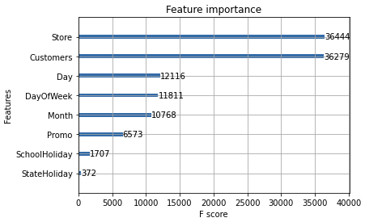

# End-to-End Machine Learning (ML) Rossmann Sales Prediction
Rossmann is Germany's second-largest drug store chain. Dataset consists of historical sales data for 1,115 Rossmann stores. The task is to forecast the "Sales" column. Note that some stores in the dataset were temporarily closed for refurbishment, so these are not included as part of the training set.

## Machine Learning Model
For this specific problem, a tree-based model was used specifically, `XGBoostRegressor`. This is to easily produce a working model because less preprocessing is needed.

It can easily handle the ff:
* Imbalanced datasets
* Mixed feature types like categorical and continuous (e.g. gender, age, number of customers, etc.)
* Not sensitive to scale - standardization/normalization is not necessary
* Both training and inference is relatively fast relative to deel learning (DL) models

## Data Preparation
From the specifications, the following columns are the input data to the model (in production); hence, model was trained on those set of features/inputs to predict sales:
```
{
  "Store":1111,
  "DayOfWeek":4,
  "Date":"2014-07-10",
  "Customers":410,
  "Open":1,
  "Promo":0,
  "StateHoliday":"0",
  "SchoolHoliday":1
}
```

## Feature Engineering
1. Split `Date` column to 2 columns: `Month` and `Day`
2. Label encoding on `StateHoliday` categorical column
    - from `['0', 'a', 'b', 'c']` to `[0, 1, 2, 3]`

## Model Training Experiments
Summary of results of training the model with different hyperparameters can be seen at the end of the Jupyter notebook (`notebooks/`). So far, the best performing model with lowest RMSE, RMSPE, and does not overfit:

Params:
* `objective="reg:squarederror"`
* `learning_rate=0.1`
* `booster='gbtree'`
* `n_estimators=1000`
* `max_depth=7`

Results:
* Train RMSE: `414.9187115956893`
* Test RMSE: `464.0707667220559`
* Train RMSPE: `0.06328874878998308`
* Test RMSPE: `0.0700014959444069`

Feature Importance



From the chart, we can see that the model predictions depend on which store, the number of customers during a specific day of the month, day of the week, month (New Year, Spring Break, Christmas, Thanksgiving, etc. months), and if there is an existing promo or not. Surprisingly, holidays whether it be school or state lightly affects the model's predictions.

## End-to-End ML Pipeline

* [Continuous Integration](.github/workflows/ci.yaml)
* [Continuous Delivery](.github/workflows/build-deploy.yaml)
* [Testing](.github/workflows/test.yaml)
* [Cleanup](.github/workflows/delete-deploy.yaml)

## Model Deployment
The best performing model was exported to an external `json` file. Model was then packaged into a REST API service. Upon initialization of the service, the model was loaded using the `XGBoost` library for production use. To handle incoming requests, inputs are preprocessed as desribed in the `Feature Engineering` section before it is fed into the model to output sales predictions.

To know more, please see: `src/deployments/model_service.py`

## Model Testing
### Unit Testing
Simple checks are implemented such as:
* Model accepts input data format
* Model works or not
* Model returns 200 status, and expected data types (etc. float, string, etc.)

To know more, please see: [src/deployments/unit-test.py](src/deployments/unit-test.py)

### Integration Testing
Another test is done once the model is deployed in a production server. The idea is to do a simple "unit testing" but with the model that is ready for production use.

To know more, please see: [src/tests/integration-test/test.py](src/tests/integration-test/test.py)

### Load Testing
Load testing is essential to simulate actual production workload to the model that would be released in production. Goals of this test is to check:
* If the model maintains a required SLA - latency (average, 95th Percentile), requests per second, error rate, etc.
* If the model service scales as the traffic increases

To know more, please see: [src/tests/load-test/locustfile.py](src/tests/load-test/locustfile.py)

# Usage
## Prerequisites
1. Python
2. Python `pip`
3. Python `requests` library
4. [BentoML](https://www.bentoml.com/)

## Deployment Usage
Make sure that the model is deployed in production, if not, just run `build-deploy.yaml` workflow. Inside the workflow run, it would output an endpoint URL that you can use. To test, you can use Postman, `curl` (bash), or `requests` (Python).

Python Example
```
import requests

input = {
    "Store": 1005,
    "DayOfWeek": 6,
    "Date": "2014-04-04",
    "Customers": 3000,
    "Open": 1,
    "Promo": 1,
    "StateHoliday": "0",
    "SchoolHoliday": 0
}
res = requests.post(url, headers=headers, data=json.dumps(input))
print(res)
```

## Local Usage
0. (Optional) Install pre-commit by:
```
pip install -r requirements.txt
pre-commit install
```

1. Install BentoML v1.0+
```
pip install bentoml
```

2. Run Unit Test
```
python src/deployments/unit-test.py

<Output>:
INPUT: {
    "Store": 1005,
    "DayOfWeek": 6,
    "Date": "2014-04-04",
    "Customers": 3000,
    "Open": 1,
    "Promo": 1,
    "StateHoliday": "0",
    "SchoolHoliday": 0
}

OUTPUT: {'sales': 16643.078, 'status': 200}
```
